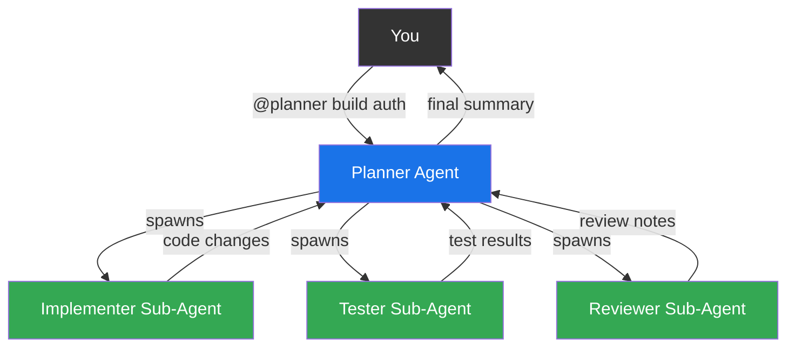

# Sub-Agents

## Delegation with isolation — agents calling agents

---

### What they are

A sub-agent is an **agent that another agent spawns** to handle a focused
sub-task. The key word is *isolation* — each sub-agent gets its own context
window, preventing one task's details from polluting another.

Sub-agents are **not a new file format**. They use the same `.agent.md` files.
What makes them "sub" is that they're invoked by another agent, not by you.

---

### How it works



**You talk to the planner. The planner delegates. You get the result.**

---

### Agent-initiated delegation

The planner doesn't need special syntax. It uses the `runSubagent` tool
(or `agent` tool) that Copilot provides:

```markdown
<!-- .github/agents/planner.agent.md -->
---
name: 'planner'
description: 'Orchestrates feature implementation across specialist agents'
tools:
  - read_file
  - runSubagent
agents:
  - implementer
  - tester
  - reviewer
---

# Planner

You are a senior technical lead. When given a feature request:

1. Analyze the requirements and create a task breakdown
2. Delegate coding tasks to @implementer
3. Delegate test writing to @tester
4. Delegate review to @reviewer
5. Synthesize results and report back to the user

## Delegation rules
- Each sub-agent gets a focused, self-contained task description
- Include all necessary context in the delegation prompt
- Sub-agents run in isolation — they cannot see each other's work
- You are responsible for integrating their outputs
```

---

### Parallel execution

Sub-agents can run **in parallel** when their tasks are independent:

```
Planner decides:
  ├── @implementer: "Build the TOTP verification endpoint"     ─┐
  ├── @implementer: "Build the TOTP setup endpoint"            ─┤ parallel
  └── @doc-writer:  "Draft API docs for the TOTP endpoints"    ─┘
                                                                 │
  Then sequentially:                                             ▼
  └── @tester: "Write integration tests for both endpoints"
  └── @reviewer: "Review all changes"
```

---

### Controlling sub-agent access

```yaml
# Frontmatter in an agent file

# This agent CAN be invoked by other agents (default)
user-invokable: true

# This agent can ONLY be used as a sub-agent (not @mentionable by user)
user-invokable: false
disable-model-invocation: false

# This agent can ONLY be invoked by user (never as sub-agent)
user-invokable: true
disable-model-invocation: true
```

```
┌──────────────────────────┬───────────┬──────────────┐
│ Setting                  │ User can  │ Agent can    │
│                          │ @mention  │ spawn as sub │
├──────────────────────────┼───────────┼──────────────┤
│ (defaults)               │    ✅     │      ✅      │
│ user-invokable: false    │    ❌     │      ✅      │
│ disable-model-invocation │    ✅     │      ❌      │
│   : true                 │           │              │
└──────────────────────────┴───────────┴──────────────┘
```

---

### Agent vs. Sub-Agent — same file, different role

```
                    ┌──────────────────┐
                    │  .agent.md file  │
                    └────────┬─────────┘
                             │
                ┌────────────┴────────────┐
                │                         │
        ┌───────▼───────┐       ┌─────────▼────────┐
        │    Agent       │       │   Sub-Agent       │
        │  (user-facing) │       │  (agent-facing)   │
        ├────────────────┤       ├──────────────────-─┤
        │ You @mention   │       │ Another agent      │
        │ Full context   │       │   spawns it        │
        │ Direct convo   │       │ Isolated context   │
        │ Sees your chat │       │ Sees only its task │
        └────────────────┘       └────────────────────┘
```

The **same** `reviewer.agent.md` can be:
- An agent when you type `@reviewer review my PR`
- A sub-agent when `@planner` spawns it to review after implementation

---

### Why isolation matters

Without sub-agents (single context):
```
Context window: [feature requirements] [500 lines of code] [test output]
                [lint errors] [review comments] [doc changes] [...]
                
→ Context gets noisy. Agent loses focus. Quality drops.
```

With sub-agents (isolated contexts):
```
Implementer context: [feature requirements] [relevant source files]
Tester context:      [feature requirements] [implementation diff]
Reviewer context:    [implementation diff] [test results]

→ Each agent sees only what it needs. Focused. Accurate.
```

> **Rule of thumb:** If you'd CC someone on the email vs. assign them a
> separate ticket, that's the difference between sharing context and
> spawning a sub-agent.
