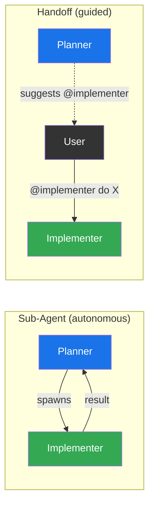

# Handoffs

## Guided workflows between agents

---

### What they are

Handoffs let an agent **recommend the next agent** to the user in a structured
way. Instead of the user needing to know which `@agent` to call next, the
current agent suggests it.

This is **not** the same as sub-agents. Handoffs keep the user in control —
they're suggestions, not autonomous delegation.

---

### The difference

```
Sub-Agent:    Agent A spawns Agent B silently
              User sees only the final result
              Agent A decides when and what to delegate

Handoff:      Agent A says "I recommend @reviewer for the next step"
              User decides whether to follow the recommendation
              User stays in the driver's seat
```



---

### Defining handoffs in an agent

```markdown
---
name: 'planner'
description: 'Break down feature requests and guide implementation'
tools:
  - read_file
  - semantic_search
handoffs:
  - implementer
  - reviewer
  - security
---

# Planner

When you've finished breaking down a feature:
1. Present the task list to the user
2. Recommend which agent should handle each task
3. Suggest starting with @implementer for the first task
```

When the planner finishes, VS Code shows clickable handoff buttons
in the chat UI, making it easy for the user to continue the flow.

---

### When to use handoffs vs. sub-agents

```
┌────────────────────────────────┬─────────────────────────────────┐
│          Handoffs              │          Sub-Agents             │
├────────────────────────────────┼─────────────────────────────────┤
│ User stays in control          │ Agent orchestrates autonomously │
│ Good for learning workflows    │ Good for practiced workflows    │
│ Each step is visible           │ Only final result is visible    │
│ User can skip/reorder steps    │ Agent decides the order         │
│ Lower risk (human in the loop) │ Higher throughput (parallel)    │
└────────────────────────────────┴─────────────────────────────────┘
```

**Start with handoffs** to learn how agents interact.
**Graduate to sub-agents** once the workflow is proven.

> **Rule of thumb:** Handoffs are training wheels for multi-agent workflows.
> Once your team trusts the flow, switch to sub-agents for speed.
