```mermaid
graph TB
    subgraph "ONE-OFF"
        P["💬 Prompt<br/>Typed in chat. Gone next session."]
    end

    subgraph "ALWAYS-ON"
        I["📜 Instructions<br/>Auto-loaded every session.<br/>Your repo's constitution."]
    end

    subgraph "ON-DEMAND"
        PF["📋 Prompt File<br/>Reusable macro. Run when invoked."]
        SK["🧰 Skill<br/>Packaged expertise + artifacts.<br/>Auto-discovered by task match."]
    end

    subgraph "MODE SWITCH"
        AG["🤖 Agent<br/>A persona + toolset.<br/>Switch into it for a role."]
    end

    subgraph "DELEGATION"
        SA["🔀 Sub-agent<br/>Isolated worker. Own context.<br/>Returns summary only."]
    end

    P --> I
    I --> PF
    PF --> SK
    SK --> AG
    AG --> SA

    style P fill:#fef3c7,stroke:#f59e0b
    style I fill:#dbeafe,stroke:#3b82f6
    style PF fill:#e0e7ff,stroke:#6366f1
    style SK fill:#d1fae5,stroke:#10b981
    style AG fill:#fce7f3,stroke:#ec4899
    style SA fill:#f3e8ff,stroke:#8b5cf6
```

# The Mental Model

## Think in layers of **persistence** and **scope**

---

---

### The two axes that matter

|  | **Ephemeral** | **Persistent** |
|--|--|--|
| **Broad scope** (all tasks) | Prompt | Instructions |
| **Narrow scope** (specific tasks) | Prompt file | Skill |
| **Role-based** (persona + tools) | — | Agent |
| **Isolated execution** | — | Sub-agent |

> **Key insight:** Moving down this stack = more structure, more reusability,
> more investment to set up — but dramatically better consistency.
