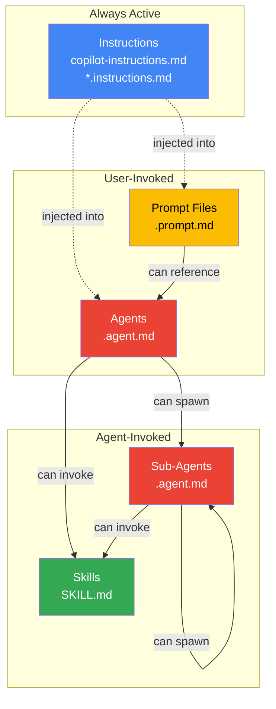

# The Spectrum

## Putting it all together — from passive to autonomous

---

### The full picture

```
  Passive                                                    Autonomous
  (rules)                                                    (actors)
    │                                                            │
    ▼                                                            ▼
┌──────────┐  ┌──────────┐  ┌──────────┐  ┌──────────┐  ┌──────────┐
│          │  │          │  │          │  │          │  │          │
│ Instruc- │→ │ Prompt   │→ │ Skills   │→ │ Agents   │→ │Sub-Agents│
│ tions    │  │ Files    │  │          │  │          │  │          │
│          │  │          │  │          │  │          │  │          │
└──────────┘  └──────────┘  └──────────┘  └──────────┘  └──────────┘
    │              │              │              │              │
  Always-on     On-demand     Invokable      Identity      Delegation
  Guardrails    Recipes       Capability     + Tools       + Isolation
```

---

### Side-by-side comparison

| Dimension         | Instructions          | Prompt Files       | Skills              | Agents             | Sub-Agents          |
|-------------------|-----------------------|--------------------|---------------------|--------------------|---------------------|
| **Activation**    | Automatic             | `#` reference      | Agent-selected      | `@` mention        | Agent-spawned       |
| **Persistence**   | Permanent per repo    | Permanent per repo | Permanent per repo  | Permanent per repo | Ephemeral per task  |
| **Scope**         | Broad (all requests)  | Narrow (one task)  | Narrow (one ability)| Broad (persona)    | Narrow (sub-task)   |
| **Identity**      | None                  | None               | None                | Yes — persona      | Yes — inherited     |
| **Tools**         | No                    | Can reference       | Can use scripts     | Own tool set       | Own tool set        |
| **Context**       | Injected into host    | Injected into host | Loaded on use       | Own context        | Isolated context    |
| **File**          | `*.instructions.md`  | `*.prompt.md`      | `SKILL.md`          | `*.agent.md`       | Same `*.agent.md`   |
| **Composable**    | Stacks with others    | Chains agents      | Used by agents      | Can spawn subs     | Can nest further    |

---

### The nesting relationship



Key insight: **Instructions flow DOWN into everything.** They're the
constitution that all agents, prompt files, and skills inherit.

---

### Decision flow — "which one do I need?"

```
START: I want to customize Copilot's behavior
  │
  ├─ Is this a rule that should ALWAYS apply?
  │    YES → Instructions (.instructions.md / copilot-instructions.md)
  │
  ├─ Is this a repeatable recipe I'll invoke by name?
  │    YES → Prompt File (.prompt.md)
  │
  ├─ Is this a capability an agent should have?
  │    YES → Skill (SKILL.md)
  │
  ├─ Does it need its own identity, tools, or persona?
  │    YES → Agent (.agent.md)
  │
  └─ Does an agent need to delegate focused work with isolation?
       YES → Sub-Agent (same .agent.md, spawned by another agent)
```

---

### Real-world layering example

```
Project: E-commerce platform
│
├── Instructions (always-on)
│   ├── "Use TypeScript strict mode"
│   ├── "All prices in cents (integer), never floats"
│   ├── "Run lint + tests before any commit"
│   └── "Follow OpenAPI 3.1 for API specs"
│
├── Prompt Files (on-demand recipes)
│   ├── #new-product-endpoint   → scaffolds CRUD for a product type
│   ├── #add-payment-method     → wires up a new payment provider
│   └── #setup-feature-flag     → creates flag + A/B test scaffold
│
├── Skills (composable capabilities)
│   ├── generate-openapi        → builds spec from route handlers
│   ├── create-migration        → diffs schema and writes SQL
│   └── deploy-preview          → spins up ephemeral environment
│
├── Agents (personas)
│   ├── @architect              → designs system-level changes
│   ├── @implementer            → writes code following designs
│   ├── @security               → audits for vulnerabilities
│   └── @release-manager        → coordinates deploy pipeline
│
└── Sub-Agents (delegated work)
    └── @architect delegates:
        ├── @implementer → "Build the payment service"
        ├── @implementer → "Build the notification service"
        └── @security    → "Audit both services"
```

> **The concepts are layers, not alternatives.** A mature project uses
> all five — each at the right level of abstraction.
